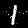
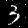

#### Some examples of mutants

We guarantee the L-infinity distance between the original and generated data to be smaller than a threshold. For MNIST and SVHN, we set the threshold as 0.5, and for the others, we set 0.05. 

##### MNIST

 &nbsp;&nbsp;&nbsp;&nbsp;&nbsp;  &nbsp;&nbsp;&nbsp;&nbsp;&nbsp;  &nbsp;&nbsp;&nbsp;&nbsp;&nbsp;  &nbsp;&nbsp;&nbsp;&nbsp;&nbsp; 

##### SVHN

    

##### Traffic

    

##### CIFAR-10

    

##### CIFAR-100

    
